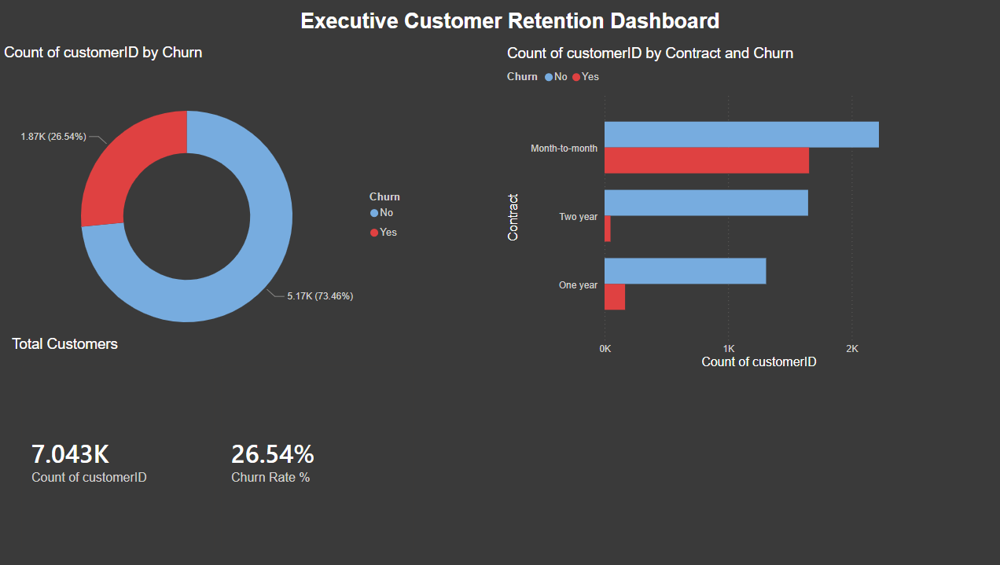

# 🚀 Executive Sales & Retention Intelligence Engine

### 📝 Project Overview
An end-to-end data engineering and analytics project simulating a real-world business scenario for a Telco and SaaS company. The goal was to identify high-risk churn segments and profitability drivers using a full-stack workflow.

 
*(Above: The final executive dashboard built in Power BI)*

### 🛠️ The Solution Architecture
- **Step 1: Data Engineering (SQL Server)** - Utilized `SSMS` to import and normalize messy CSV data.
  - Created persistent `VIEWS` to handle data type casting and ensure data integrity.
  - Implemented `CTEs` (Common Table Expressions) for modular logic.
- **Step 2: Business Intelligence (Power BI)** - Modeled data relationships (Star Schema).
  - Developed custom `DAX` measures for Churn Rate and YoY Growth.
  - Designed an interactive UI with "What-If" parameters to simulate revenue recovery.

### 🔑 Key Findings
1.  **The "Month-to-Month" Risk:** Customers on monthly contracts are **6.5x more likely to churn** than those on 2-year plans.
2.  **Profitability Drivers:** The Finance industry sector has a **15% higher profit margin** than the Tech sector, despite lower volume.
3.  **Financial Impact:** Reducing churn in the Fiber Optic segment by just 10% would save **$14,500 monthly**.

### 💻 How to View
- View the **SQL Logic** in [`ETL_Views_Cleanup.sql`](ETL_Views_Cleanup.sql).
- Download the `.pbix` file to view the interactive dashboard.
